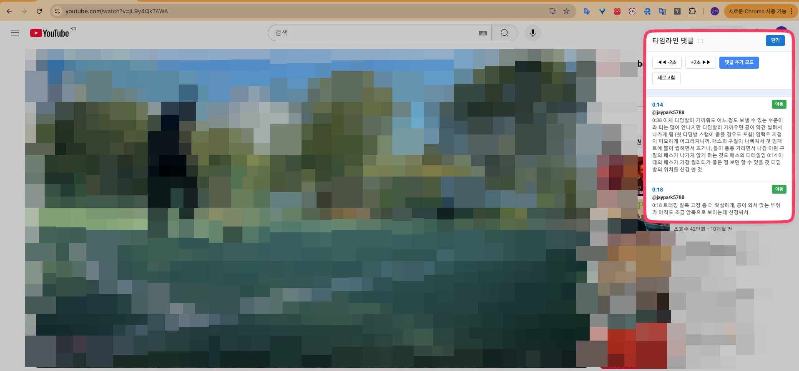

# YouTube Timeline Comments

유튜브 타임라인 댓글을 편하게 관리하고 보는 크롬 확장 프로그램입니다.

## 서비스 화면

### 메인 화면

 - YouTube 동영상 페이지에서 타임라인 댓글이 표시되는 모습
 - 확장 프로그램 아이콘 클릭 시 나타나는 설정 팝업
 - 동영상 재생 시간에 맞춰 댓글이 표시되는 기능


## 설치 방법

### 1. 소스 코드 다운로드
```bash
git clone [repository-url]
cd futsal-youtube
```

### 2. 크롬 확장 프로그램 설치

1. 크롬 브라우저를 열고 주소창에 `chrome://extensions/` 입력
2. 우측 상단의 "개발자 모드" 토글을 활성화
3. "압축해제된 확장 프로그램을 로드합니다" 버튼 클릭
4. 다운로드한 프로젝트 폴더 선택
5. 확장 프로그램이 설치되면 브라우저 툴바에 YouTube Timeline Comments 아이콘이 나타남

### 3. 사용 방법

1. YouTube 동영상 페이지로 이동
2. 동영상 플레이어 아래에 타임라인 댓글 섹션이 자동으로 나타남
3. 확장 프로그램 아이콘을 클릭하여 추가 설정 가능

## 주요 기능

- 유튜브 동영상의 타임라인 댓글 표시
- 댓글 관리 및 정리
- 사용자 친화적인 인터페이스

## 권한 설명

이 확장 프로그램은 다음 권한을 필요로 합니다:

- `activeTab`: 현재 활성화된 탭에서 동작
- `storage`: 사용자 설정 저장
- `tabs`: 탭 정보 접근
- `*://*.youtube.com/*`: YouTube 사이트에서만 동작

## 브라우저 호환성

- Chrome 88 이상
- Microsoft Edge 88 이상
- 기타 Chromium 기반 브라우저